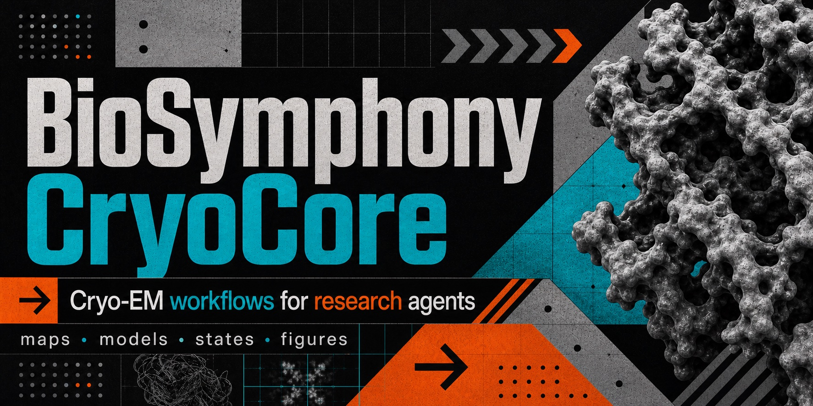
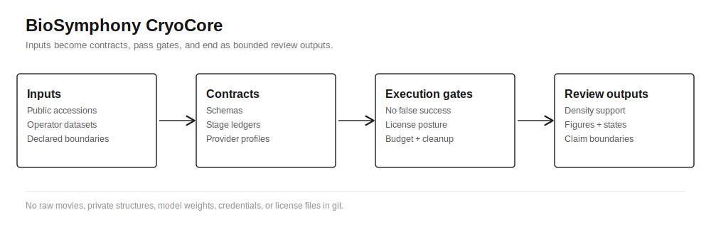
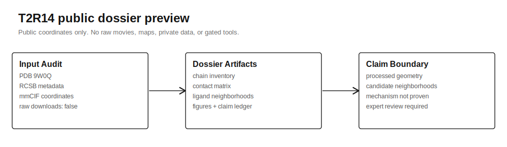
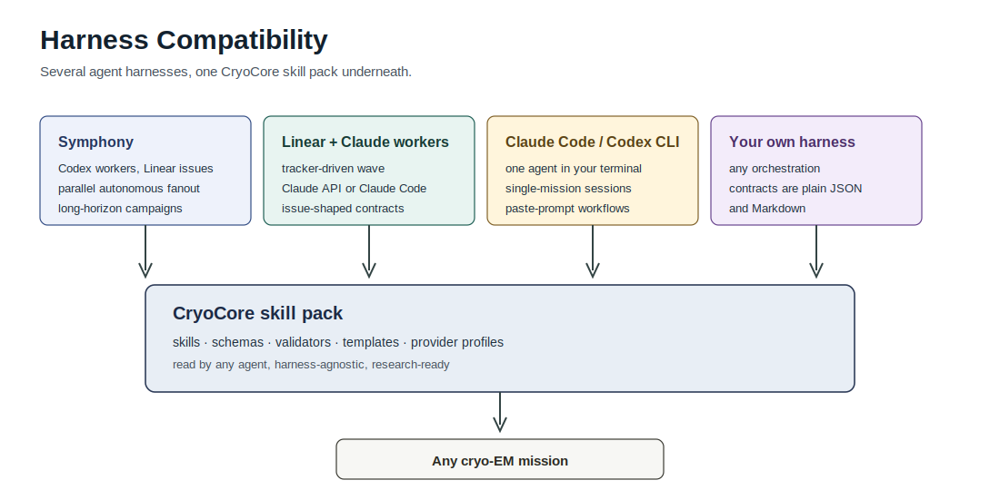
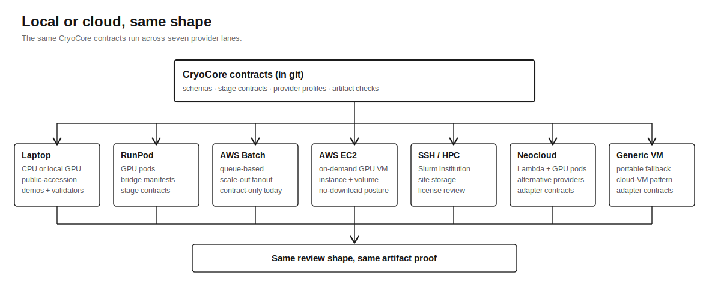
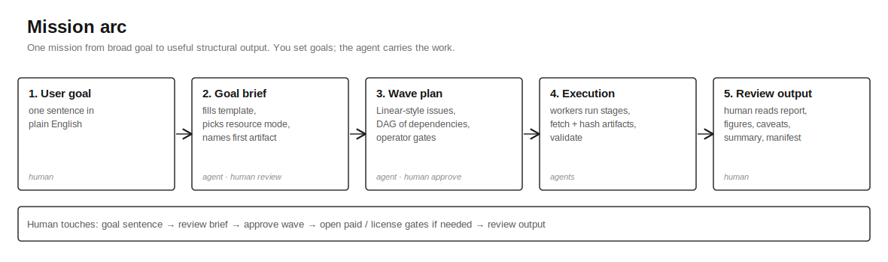
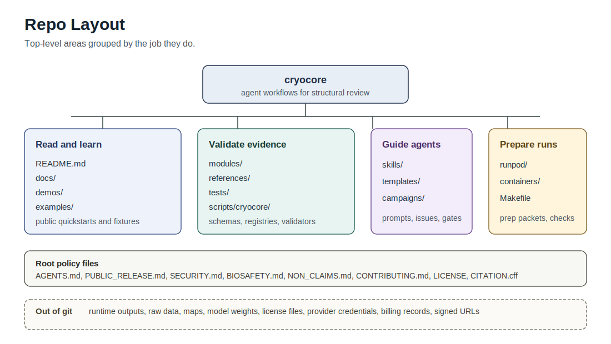
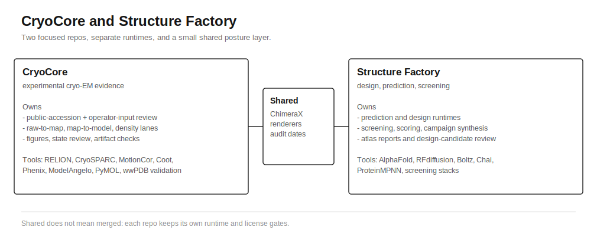

# BioSymphony CryoCore

[](LICENSE)
[](https://www.python.org/downloads/)
[](#five-minute-start)
[](#status)

**A cryo-EM skill pack for agents that need to plan, run, and review long-horizon structural work.**



CryoCore gives coding agents a practical operating layer for cryo-EM work. An
agent can read the skills, choose the right workflow, keep inputs and outputs
organized, prepare figures, compare structures, and set up local or cloud runs
without inventing a process from scratch.

The repo supplies skill instructions, prompt fixtures, JSON Schema contracts,
tool-lane records, provider launch templates, and local checkers your agents can
read directly and act on. The same workflow shape runs on a laptop with public
accessions or on RunPod, AWS Batch, SSH/HPC, neocloud VMs, and other providers
you already use. The contracts keep long-running agent work legible across
handoffs.



## How You Use It

Point your agent at this repo and hand it a cryo-EM goal. The agent reads
[AGENTS.md](AGENTS.md), the relevant skill under [skills/](skills/), and the
schemas under [modules/schemas/](modules/schemas/). It can fetch
public-accession metadata when the workflow calls for it, inspect map/model
inputs, draft figure plans, compare states, prepare provider lanes, and return a
clear work package with methods, provenance, artifacts, caveats, and next steps.

You stay the principal. You set the goal, you open gates that need human
authorization (paid GPU time, license acceptance, raw-data access, claim
escalation), and you review what your agent produces. The commands throughout
this README are what your agent runs on your behalf. You can run them yourself
when you want to verify a step or explore the repo directly.

## What Your Agent Can Do

The pieces an agent reads and acts on while doing real cryo-EM work:

- **Map/model review** starts from public EMDB/PDB accessions or operator-declared inputs and asks what the density, model, fit metrics, and caveats support.
- **Figure and state workflows** route ChimeraX, Mol*, Coot, PyMOL, Blender, heterogeneity, and comparison work into reproducible figure or comparison outputs.
- **Cryo-EM lane modules** describe real stages: raw movies, corrected micrographs, particles, maps, models, figures, and state-review artifacts. See `modules/lane-modules/raw-to-map.v1.json`, `map-to-model.v1.json`, and `figure-dossier.v1.json`.
- **Tool posture docs** name which cryo-EM tools fit which lane and under what license terms (RELION, MotionCor3, Warp/M, Topaz, cryoDRGN, ModelAngelo, Coot, Phenix, ChimeraX, and more in `references/software-registry.yaml`). The agent picks tools from this catalog rather than guessing.
- **Provider profiles** for RunPod, AWS Batch, AWS EC2, SSH/HPC Slurm, neocloud GPU pod (e.g. Lambda), generic cloud GPU VM, and local workstation give the agent a shape for launching those tools on real GPUs, with budget and cleanup gates baked in. Users with custom compute can author their own profile against the same schema. See [Compute Backends](docs/compute-backends.md#custom-providers).
- **Schemas, ledgers, and checkers** type the intermediate outputs and check artifacts, hashes, cost records, cleanup proof, and claim boundaries so a follow-on agent or reviewer can pick up the work without re-deriving context.

The review outputs, figure manifests, provider plans, and issue waves under [Use Cases](docs/use-cases.md) show how those pieces come together for real goals.

## Core Capabilities

| Capability | What it gives your agents |
| --- | --- |
| Map/model and density review | Hand an agent EMDB/PDB IDs or operator-declared inputs and get back summaries of maps, models, density support, fit metrics, caveats, and follow-up work. |
| Figure and state workflows | Prepare reproducible structural figures, renderer routes, comparison axes, and heterogeneity or conformational-state review plans. |
| Real cryo-EM tool routing | RELION, MotionCor3, Warp/M, Topaz, cryoDRGN, ModelAngelo, Coot, Phenix, ChimeraX, Mol*, PyMOL, and related tools stay mapped to lanes, licenses, and runtime boundaries. |
| Local or cloud, same shape | RunPod, AWS Batch, SSH/HPC, neocloud, generic cloud VM, or laptop CPU. Provider profiles, stage contracts, launch prep, and budget/cleanup gates stay uniform across them. |
| Works with the harness you already use | Symphony, Linear with Claude or Codex workers, Claude Code, Codex CLI, or your own orchestration. The skill pack, schemas, and validators are harness-agnostic. |
| Handoff layer for agent work | Artifacts, hashes, checker outputs, cost records, cleanup proof, provenance, and claim boundaries are recorded before a result is treated as complete. |

Every tool the agent picks routes through one of three license lanes:


## What You Can Do With It

| Use case | What CryoCore gives you |
| --- | --- |
| Point an agent at a cryo-EM repo | Skills, prompts, docs, schemas, and check commands that turn loose requests into executable structural workflows. |
| Review EMDB/PDB accessions | Input audits, map/model summaries, density-support checks, figures, provenance, caveats, and bounded claims. |
| Prepare figure or state work | Renderer routes, figure manifests, methods/provenance text, heterogeneity comparison axes, and reproducibility notes. |
| Prepare cloud or HPC execution lanes | Provider profiles, stage contracts, launch-request prep, budget gates, cleanup requirements, and artifact expectations. |
| Run agent issue waves | Tracker-ready templates, labels, DAGs, worker outcome blocks, and reference checks. |
| Review a provider run | Checks artifacts, hashes, cost records, cleanup proof, and allowed claims before a stage is treated as complete. |
| Track cryo-EM tool posture | Open/watch/gated registry records with license and image-packaging boundaries. |

See [Workflow Blueprints](docs/workflows.md) for how to choose a path,
[Goal Orchestration](docs/goal-orchestration.md) for `/goal`-style agent setup,
and [Use Cases](docs/use-cases.md) for copyable prompts.

## Choose Your Path

| I am... | Start here | First command |
| --- | --- | --- |
| New to CryoCore | [Public Quickstart](docs/public-quickstart.md) | `make demo-local` |
| Want a guided walk-through | [Tour](docs/tour.md) | `make demo-local` |
| Pointing an agent at the repo | [Agent Quickstart](docs/agent-quickstart.md) | `make skill-check` |
| Turning a broad goal into work | [Goal Orchestration](docs/goal-orchestration.md) | `make goal-brief-check` |
| Choosing a workflow | [Workflow Blueprints](docs/workflows.md) | `make docs-link-check` |
| Reusing patterns elsewhere | [Adoption Guide](docs/adoption-guide.md) | `make docs-link-check` |
| Preparing cloud resources | [Compute Backends](docs/compute-backends.md) | `make provider-check` |
| Planning Linear issue waves | [Tracker Orchestration](docs/linear-orchestration.md) | `make issue-check` |
| Checking a provider run | [Provider Run Review](docs/use-cases.md#2-provider-run-review) | `make provider-closeout-check` |
| Preparing a public switch | [Public Release](PUBLIC_RELEASE.md) | `make release-check` |

## Workflow Chooser

The `Claim ceiling` column uses CryoCore's claim ladder. See
[Claim Levels](docs/claim-levels.md) for what `candidate`, `processed`,
`validated`, and `publishable` mean.

| Starting point | Goal | First command | Side effects | Expected output | Claim ceiling |
| --- | --- | --- | --- | --- | --- |
| New checkout | See the repo work | `make demo-local` | public RCSB/mmCIF fetch, writes `.runtime/` | HTML report, figures, manifest, claim boundaries | `processed` demo evidence |
| EMDB/PDB IDs | Plan or build a map/model review | [Map/Model Dossier](docs/recipes/map-model-dossier.md) | public metadata/artifact fetch only when commanded | input audit, summaries, figures, provenance, caveats | `processed` or `candidate` |
| Cloud/HPC idea | Prepare provider work | `make provider-check` | no provider mutation | provider profile, gates, launch-request plan | `candidate` until artifacts are joined |
| Linear campaign | Split work for agents | `make issue-check` | no network or provider mutation | issue DAG, dependencies, labels | `candidate` |
| Fetched run artifacts | Decide if a run is complete | `make provider-closeout-check` | local fixture check only | blockers, hashes, cost, cleanup, claim level | artifact-dependent |
| Public switch | Check publishability | `make release-check` | local checks and secret scan | release report and blockers | repo readiness only |

## Five-Minute Start

These commands set up the toolkit and run the first demo. Your agent will
execute them once it is pointed at the repo. You can also run them yourself
to confirm the demo works on your machine before handing the keys to an agent.

```bash
python3 -m pip install -r requirements-dev.txt
make demo-local
```

This fetches public RCSB/mmCIF data and writes the output under ignored
`.runtime/`. Raw movies, maps, half-maps, model weights, private data, license
files, and gated tools stay outside the demo.

Then inspect:

- `.runtime/t2r14-open-dossier/artifacts/report.html`
- `.runtime/t2r14-open-dossier/artifacts/claim_ledger.md`
- `.runtime/t2r14-open-dossier/artifacts/dossier_manifest.json`

What the first run gives you:

| Artifact | Why it matters |
| --- | --- |
| `report.html` | A human-readable review page with public inputs, figures, and methods. |
| `claim_ledger.md` | Claim boundaries and caveats, so an agent cannot turn a summary into unsupported mechanism claims. |
| `dossier_manifest.json` | Machine-readable inputs, artifacts, provenance, and review state. |
| `runpod-execution.tar.gz` | Portable artifact bundle shape used later by provider review. |

No run yet? Inspect the static sample shape in
[T2R14 Open Dossier Preview](examples/t2r14-open-dossier-preview/).



Expected success looks like:

```json
{
  "ok": true,
  "run_id": "cryocore-demo-t2r14-open-dossier"
}
```

Run the local public release gate:

```bash
make release-check
```

Prefer explicit commands?

```bash
python3 scripts/cryocore/t2r14_open_dossier.py --out .runtime/t2r14-open-dossier --json
python3 -m json.tool .runtime/t2r14-open-dossier/status.json
```

## Agent Prompt

Paste this into your coding agent from the repo root. This is the canonical
prompt; [docs/agent-quickstart.md](docs/agent-quickstart.md) uses the same one.

```text
Use the CryoCore skill pack in this repo. Stay local. Read AGENTS.md,
README.md, docs/goal-orchestration.md, docs/workflows.md, docs/use-cases.md,
and the relevant skill under skills/. Build a useful cryo-EM map/model review,
figure workflow, state comparison, provider plan, or artifact package. Keep
private data, secrets, raw or heavy artifacts, provider logs, model weights,
and license files out of git and public outputs. Run the smallest relevant
checks first, then `make release-check` when the task is release-readiness.
Report exact artifacts, claim levels, check results, and remaining issues.
```

More agent patterns are in [Agent Quickstart](docs/agent-quickstart.md) and
[Agent Task Prompts](examples/agent-tasks/).

Copying this into another repo? Start with [Adoption Guide](docs/adoption-guide.md).

## Using CryoCore With Your Agents



CryoCore is built so any agent stack can drive it. A few patterns teams already use:

| Pattern | How it runs | Where to start |
| --- | --- | --- |
| Symphony with Codex workers | Symphony dispatches autonomous Codex (gpt-5.x) workers against Linear issues; each worker reads the relevant CryoCore skill and reports an outcome block. | [templates/symphony-cryocore.WORKFLOW.md](templates/symphony-cryocore.WORKFLOW.md), [docs/linear-orchestration.md](docs/linear-orchestration.md) |
| Linear with Claude workers | Linear holds the campaign DAG and labels; Claude Code or Claude API agents pick up issues, read the skill pack, and produce review-ready artifacts. | [templates/linear-issue.md](templates/linear-issue.md), [docs/agent-quickstart.md](docs/agent-quickstart.md) |
| Claude Code or Codex CLI in your terminal | One agent reads `AGENTS.md`, the chosen skill, and the relevant validators, then drives a single mission end to end. | [Agent Prompt](#agent-prompt), [skills/](skills/) |
| Your own orchestration | Every contract is plain JSON Schema or Markdown. Wire CryoCore into the orchestration you already run. | [docs/agent-skill-guide.md](docs/agent-skill-guide.md), [modules/schemas/](modules/schemas/) |

The same skill pack supports a single-agent session on a laptop, a multi-day
campaign with dozens of issues running in parallel, and a cloud or HPC
dispatch with provider-neutral launch contracts and artifact proof.

Local or cloud, the contracts stay the same:



- Laptop or workstation: public-accession demos, CPU-only checks, claim-boundary drafts.
- RunPod, AWS Batch, SSH/HPC, neocloud VMs: launch manifests, stage contracts, fetched-artifact reports, cost and cleanup proof.
- Mixed: plan and validate locally, then hand the same campaign to cloud workers when GPU time is ready.

## Install Model

Use CryoCore as a source checkout. Clone or copy it, install
`requirements-dev.txt`, and run `make` targets or `python3
scripts/cryocore/*.py` commands from the repository root. A pip-installable
package is on the roadmap.

## Core Workflow

The shape a mission follows from starting goal to useful structural output.
Your agent carries each step. You step in at the gates.



In detail, each mission:

1. Declares public accessions or operator-provided inputs.
2. Audits inputs and data boundaries before work starts.
3. Inspects maps, models, density support, states, or figure needs.
4. Routes tools through open, watch, or runtime-gated lanes.
5. Tracks stage progress, artifacts, hashes, cost, cleanup, and claim level.
6. Emits a review output with figures, methods, provenance, caveats, and next steps.

The same shape works at three scales:

- local: small public demos and validators only
- cloud: operator-gated RunPod, AWS, SSH/HPC, or compatible provider contracts
- tracker: Linear-style issue waves with explicit dependencies and review gates

Use [Workflow Blueprints](docs/workflows.md) to pick the right scale before
dispatching work.

CryoCore separates experimental cryo-EM processing from AI design runtimes. The
design side can consume CryoCore outputs while RELION, Warp/M, MotionCor,
ModelAngelo, ChimeraX, Coot, and validation tooling keep their own images and
dependency surfaces apart from RFdiffusion, Boltz, Chai, ProteinMPNN, and
screening stacks.

## Handoff Layer

CryoCore keeps the working record explicit so an agent can carry work across
days or weeks and hand it to a human reviewer with nothing missing:

- the public accession, operator dataset, or derived artifact used as input
- the tool lane that was planned, gated, or executed
- the stage that actually completed
- the artifacts that were produced and hashed
- the licenses or use-context approvals required
- the claims or next steps supported by the artifacts

A stage becomes trustworthy when the artifacts are joined to the declared
inputs and the check outputs, checksums, cost records, cleanup proof, and
claim boundaries are all in place.

The shape of one mission, at a glance:

```text
   public accessions               operator data
        |                                |
        +----------------+---------------+
                         |
                         v
   +-------------------------------------------+
   |  input audit and resource mode            |
   +---------------------+---------------------+
                         |
                         v
   +-------------------------------------------+
   |  tool lane: open, watch, runtime-gated    |
   +---------------------+---------------------+
                         |
                         v
   +-------------------------------------------+
   |  stage: prep mode or real mode            |
   +---------------------+---------------------+
                         |
                         v
   +-------------------------------------------+
   |  artifacts + hashes + cost records        |
   +---------------------+---------------------+
                         |
                         v
   +-------------------------------------------+
   |  checks: schemas, contract self-check,    |
   |  wwPDB rollup                             |
   +---------------------+---------------------+
                         |
                         v
   +-------------------------------------------+
   |  review output: figures, caveats,         |
   |  claim boundaries, next steps             |
   +-------------------------------------------+
```

## Repo Layout



<details>
<summary>Full file listing</summary>

```text
campaigns/        CryoCore campaign contracts
containers/       Public image posture and runtime separation notes
demos/            Public cryo demos and review readouts
docs/             Durable architecture, split, licensing, and data-policy docs
examples/         Tiny example manifests
modules/          Image, lane, and provider contracts
references/       Machine-readable tool registry
scripts/cryocore/ Validators and local utilities
skills/cryocore/  Repo-local skill instructions
templates/        Tracker issue and operator-gate templates
tests/            Lightweight validator tests
```

</details>

## High-ROI Assets

- `modules/lane-modules/raw-to-map.v1.json`, `map-to-model.v1.json`, and `figure-dossier.v1.json`: scientific lane shapes for processing, model review, and figures.
- `scripts/cryocore/t2r14_open_dossier.py`, `poltheta_map_model_dossier.py`, and `structure_jury_dossier.py`: runnable public-accession review demos.
- `modules/schemas/`: provider-run, workflow-run, claim-ledger, figure-manifest, map-model-fit, artifact-index, cost, cleanup, and accession metadata schemas.
- `modules/artifact-contracts/structure-dossier.v1.json`: claim-level ladder and required artifacts.
- `runpod/stage-contracts/`: stage contracts with progress-ledger requirements that close only when each stage is confirmed.
- `scripts/cryocore/provider_closeout_check.py`: confirms artifacts, hashes, cost records, and cleanup proof are all in place before a provider run is treated as complete.
- `scripts/cryocore/contract_self_check.py`: checks that real provider results are backed by real artifacts rather than mocks, fixtures, planned-only entries, or fallbacks.
- `scripts/cryocore/public_snapshot_check.py`: scans a public snapshot for secrets, heavy cryo-EM artifacts, local paths, and private execution markers.
- `scripts/cryocore/runpod_scope_check.py`: scans public bridge manifests, inline source bundles, public service scope, and prep-only gates.
- `scripts/cryocore/runpod_reference_check.py`: confirms public entrypoints are present and resume commands are current.
- `docs/agent-skill-guide.md` and `docs/prompt-library.md`: agent workflows and reusable prompt patterns.
- `docs/workflows.md`: workflow selector for public accessions, agents, cloud resources, Linear issue waves, and provider review.
- `skills/cryocore-public-safety/SKILL.md`: public-release review for privacy, secrets, provider risk, and claims.
- `docs/recipes/README.md`: copyable workflows for release checks, metadata ledgers, demo runs, provider prep, and provider run review.
- `docs/validation-command-matrix.md` and `docs/failure-modes.md`: command selection and post-run review of stage outcomes.
- `references/software-registry.yaml`: machine-readable tool posture across open, watch, and runtime-gated cryo-EM tools.

## Boundary With Structure Factory



CryoCore owns experimental cryo-EM processing and structural review. Structure Factory owns cross-lane orchestration, prediction/design, screening, and campaign synthesis.

The two repos intentionally duplicate a small set of shared posture records. ChimeraX is the clearest example: it belongs in CryoCore for map/model inspection and figure rendering, and it belongs in Structure Factory for design and atlas reports. Duplicating these records lets each repo keep a focused scientific runtime.

See [Split Evaluation](docs/split-evaluation.md) and
[Move/Duplicate Map](docs/move-duplicate-map.md).

## Related Projects

- [Proteus](https://github.com/jvogan/proteus): structural-biology skills for AI coding agents, including PyMOL and ChimeraX automation plus AlphaFold DB, RCSB PDB, UniProt, and Rosetta workflows. Pairs well with CryoCore when a mission needs hands-on molecular visualization or sequence/structure lookups alongside cryo-EM map/model review.

## Public Demos

- [T2R14 Open Dossier](demos/t2r14-open-dossier/): CPU-only public PDB/EMDB metadata and coordinate review.
- [Pol Theta Map/Model Dossier](demos/poltheta-map-model-dossier/): public EMDB/PDB/wwPDB validation review shape for a map/model lane.
- [Dual Structure Comparison](demos/structure-jury-dual-dossier/): joins two public deposited-structure lanes into one review package.

Demo launch manifests are public scaffolds for the prep stage. Paid provider execution is operator-initiated, uses current credentials kept outside the repo, and is reviewed against fetched, hashed artifacts.

## Quickstart

The fastest path is [Public Quickstart](docs/public-quickstart.md). The
agent-first path is [Agent Quickstart](docs/agent-quickstart.md).

## Current Toolwatch

See [Toolwatch 2026-05-27](docs/toolwatch-2026-05-27.md) for the
source-backed shortlist refreshed on 2026-05-27: cryo-EM tools, repos, public
data APIs, workflow/provenance helpers, and preprints. The prior
[Toolwatch 2026-05-15](docs/toolwatch-2026-05-15.md) remains as history. See
[Workflow Orchestration Provenance](docs/workflow-orchestration-provenance.md)
and [Public Accession APIs](docs/public-accession-apis.md) for the recommended
provenance and metadata-helper direction.

## Local Commands

The menu your agent has available. Each command is read-only on local files
unless noted in the linked docs. You can run any of them directly to verify
what the agent is doing.

```bash
python3 scripts/cryocore/preflight.py --repo-root . --json
python3 scripts/cryocore/software_registry_check.py references/software-registry.yaml --json
python3 scripts/cryocore/fetch_public_accession_metadata.py --emdb EMD-43816 --pdb 9ASJ --out .runtime/public-accession-metadata.json
make module-check
make runpod-check
make runpod-scope-check
make issue-check
make contract-self-check
make release-check
```

All commands above run locally. They validate contracts, query public accession
APIs when invoked, and write any output to ignored `.runtime/`. Provider
dispatch, raw-data downloads, gated software installs, and GPU workloads are
operator-initiated steps documented separately. See
[Data Policy](docs/data-policy.md).

Run the public release gate:

```bash
make release-check
```

## Status

Pre-alpha public release. CryoCore currently supports agent-guided map/model
review on public accessions, figure and state workflow planning, provider
preflight, contract validation, provider-run review templates and fixtures,
Linear-style campaign planning, tool and license posture tracking, and
claim-bounded structural evidence packets. The CPU-only T2R14 demo runs end to
end on a laptop; paid provider lanes ship as prep-mode contracts that an
operator executes outside the public repo. The rigor in the contracts is what
lets agents move quickly on workflows that later touch expensive GPU compute,
gated scientific tools, and heavy artifacts.

## Documentation Map

- [Tour](docs/tour.md): fifteen-minute guided walk through the repo, with a paste-into-agent prompt at the end.
- [Public Quickstart](docs/public-quickstart.md): first commands and demo outputs.
- [Demos](demos/README.md): three runnable public demos indexed by complexity and time.
- [Mission Catalog](docs/mission-catalog.md): menu of seed missions an agent can take on, sorted from smallest to largest.
- [Pol Theta Walkthrough](docs/missions/pol-theta-walkthrough.md): narrative end-to-end mission from broad goal to map/model review.
- [Agent Quickstart](docs/agent-quickstart.md): copy-paste agent prompt and routing.
- [Workflow Blueprints](docs/workflows.md): choose public-accession, agent, cloud, Linear, or run-review paths.
- [Use Cases](docs/use-cases.md): common workflows and copyable prompts.
- [Adoption Guide](docs/adoption-guide.md): how to reuse CryoCore patterns elsewhere.
- [Local Installation](docs/local-installation.md): source-checkout install model.
- [Agent Skill Guide](docs/agent-skill-guide.md): using this repo as a public skill pack.
- [Skill Installation](docs/skill-installation.md): using or copying the skill pack locally.
- [Recipes](docs/recipes/README.md): copyable workflow recipes.
- [Validation Command Matrix](docs/validation-command-matrix.md): validator selection and command side effects.
- [Failure Modes](docs/failure-modes.md): triage guide for stage outcomes, privacy issues, and provider-risk situations.
- [Prompt Library](docs/prompt-library.md): prompt patterns for agents and reviewers.
- [Demo Gallery](docs/demo-gallery.md): demo scope, artifacts, and claim boundaries.
- [Data Policy](docs/data-policy.md): data tiers and git boundaries.
- [Provider Execution Model](docs/provider-execution-model.md): provider launch, evidence, and artifact-review model.
- [Compute Backends](docs/compute-backends.md), [Provider Readiness](docs/provider-readiness.md), and [Tracker Orchestration](docs/linear-orchestration.md): cloud-resource and Linear-style campaign workflow.
- [Claim Levels](docs/claim-levels.md): claim ladder and downgrade triggers.
- [Schema Catalog](docs/schema-catalog.md) and [Module Catalog](docs/module-catalog.md): contract inventory.
- [Privacy Threat Model](docs/privacy-threat-model.md): privacy and release-risk controls.
- [Troubleshooting](docs/troubleshooting.md): common validation failures.
- [Public Switch Checklist](docs/public-switch-checklist.md): local-to-public publishing checklist.
- [Glossary](docs/glossary.md): public terms and internal orchestration vocabulary.
- [FAQ](FAQ.md) and [Roadmap](ROADMAP.md): community orientation and next milestones.
- [Governance](GOVERNANCE.md) and [Maintainers](MAINTAINERS.md): review and release ownership.
- [Agent Task Prompts](examples/agent-tasks/README.md): prompt fixtures for agents.
