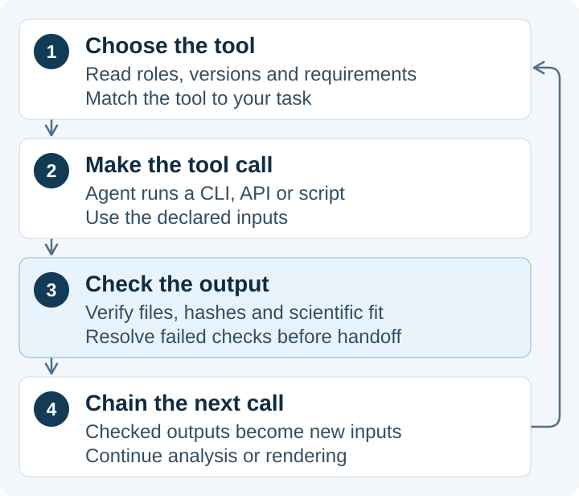

# BioSymphony CryoCore

[](LICENSE)
[](https://www.python.org/downloads/)
[](#quickstart)
[](#status)

CryoCore is a toolkit for AI agents working with cryo-electron microscopy
(cryo-EM) data. Use it to plan processing jobs, review how atomic models fit
experimental maps, compare conformational states, and prepare structural figures.

The repository supplies agent skills, workflow templates, and validation
scripts. Start with a CPU-only demo that turns public structure records into
an HTML review report. Full cryo-EM processing requires separately installed
scientific software.


## Quickstart

Use a source checkout with Python 3.10 or later:

```bash
python3 -m venv .runtime/venv
. .runtime/venv/bin/activate
python3 -m pip install -r requirements-dev.txt
make demo-local
```

The CPU-only demo fetches public RCSB coordinates and metadata, then writes
its results under `.runtime/t2r14-open-dossier/`. Open
`.runtime/t2r14-open-dossier/artifacts/report.html` for the report;
`claim_ledger.md` records evidence limits, and `dossier_manifest.json` records
inputs and outputs. A successful run reports `"ok": true`.

For an example without a network request, open the
[T2R14 preview](examples/t2r14-open-dossier-preview/). To check the repository:

```bash
make release-check
```

This runs local validators, tests, and secret scanning when Gitleaks is
installed. Set `REQUIRE_GITLEAKS=1` to require the scanner. See the
[validation command matrix](docs/validation-command-matrix.md) for individual
checks and side effects.

## Choose Your Path

| Task | Start here | Output |
| --- | --- | --- |
| Learn the repository | [Tour](docs/tour.md), [public quickstart](docs/public-quickstart.md) | Local demo and contract overview |
| Give an agent a goal | [Agent quickstart](docs/agent-quickstart.md), [goal orchestration](docs/goal-orchestration.md) | Plan with inputs, outputs, and checks |
| Review deposited maps and models | [Map/model recipe](docs/recipes/map-model-dossier.md) | Fit metrics, validation summaries, figures, and caveats |
| Compare conformational states | [Workflow blueprints](docs/workflows.md), [mission catalog](docs/mission-catalog.md) | State assignments with supporting and conflicting evidence |
| Prepare cloud or HPC work | [Compute backends](docs/compute-backends.md), [provider readiness](docs/provider-readiness.md) | Launch and stage contracts, budget, and cleanup requirements |
| Review fetched provider output | [Provider run review](docs/use-cases.md#2-provider-run-review) | Artifact, checksum, cost, and cleanup checks |
| Coordinate tracker issues | [Tracker orchestration](docs/linear-orchestration.md) | Issue dependencies and acceptance criteria |
| Reuse contracts or skills | [Adoption guide](docs/adoption-guide.md), [skill installation](docs/skill-installation.md) | Source-checkout or standalone skill setup |
| Prepare a release | [Public release](PUBLIC_RELEASE.md) | Content checks and remaining release blockers |

## Agent Prompt

Paste this prompt into your coding agent from the repository root. The
[agent quickstart](docs/agent-quickstart.md) carries the same prompt.

```text
Use the CryoCore skill pack in this repo. Stay local. Read AGENTS.md,
README.md, docs/goal-orchestration.md, docs/workflows.md, docs/use-cases.md,
and the relevant skill under skills/. Prepare a cryo-EM map/model review,
figure workflow, state comparison, provider plan, or artifact package.
State which conclusions the available evidence supports. Keep private data,
secrets, raw or heavy artifacts, provider logs, model weights, and license
files out of git and public outputs. Run the smallest relevant checks first,
then `make release-check` for release-readiness tasks. Report exact artifacts,
claim levels, check results, and remaining issues.
```

[Agent task prompts](examples/agent-tasks/) and the
[prompt library](docs/prompt-library.md) cover narrower tasks. The contracts
work with a terminal agent, tracker-managed workers, or custom orchestration.
See the [agent skill guide](docs/agent-skill-guide.md) for integration details.

## Evidence And Execution

A CryoCore workflow declares inputs, selects tools, records execution, and
checks the resulting artifacts. The [claim ledger](docs/claim-levels.md)
distinguishes candidates, processed outputs, validated evidence, and material
ready for expert publication review. Missing inputs or validation keep the
claim at a lower level.



| Check | Required record |
| --- | --- |
| Input audit | Accessions or authorized input references, checksums, and data policy |
| Runtime preparation | Tool versions, licenses, environment, and resource budget |
| Execution | Commands, stage outcomes, and artifact paths |
| Scientific review | Map/model fit, geometry, independent validation, and limitations |
| Provider run review | Fetched artifacts, matching hashes, cost report, and cleanup proof |

Validate AI-enhanced maps and AI-built models against the original experimental
evidence before interpreting added detail. See the
[validation gates](references/validation-gates.md).

Keep raw data, maps, model weights, credentials, and heavy outputs in external
storage or ignored runtime directories.

Paid provider execution, license acceptance, and raw-data transfer require
operator authorization. Public launch examples remain preparation contracts.
A provider status alone cannot establish scientific success.

## Current Toolwatch

The [September 22 toolwatch](docs/toolwatch-2026-09-22.md) covers recent AI
methods, software releases, source corrections, and evaluation priorities.
The [software registry](references/software-registry.yaml) records tool roles,
terms, versions, and expected artifacts. [Tooling and licensing](docs/tooling-and-licensing.md)
and the [promotion policy](docs/toolwatch-to-lane-policy.md) define the checks
needed before a tool becomes a runtime dependency.

Historical reviews: [August](docs/toolwatch-2026-08-30.md),
[July](docs/toolwatch-2026-07-05.md), [June](docs/toolwatch-2026-06-21.md),
and [May](docs/toolwatch-2026-05-27.md).

## Public Demos

| Demo | Scope |
| --- | --- |
| [T2R14](demos/t2r14-open-dossier/) | Runnable CPU-only review of public coordinates and metadata |
| [Pol Theta](demos/poltheta-map-model-dossier/) | Map/model workflow preparation with public validation records |
| [Dual structure comparison](demos/structure-jury-dual-dossier/) | Preparation for joining two deposited-structure reviews |

The [demo gallery](docs/demo-gallery.md) lists outputs and limitations.

## Repository Layout

| Directory | Contents |
| --- | --- |
| `campaigns/`, `templates/` | Campaign specs, issue templates, and operator gates |
| `modules/`, `runpod/` | Processing stage definitions, schemas, and provider profiles |
| `scripts/cryocore/`, `tests/` | Validators, demo runners, and small fixtures |
| `skills/` | Agent instructions and bundled references |
| `references/`, `docs/` | Tool registry, evidence requirements, and guides |
| `examples/`, `demos/` | Small public examples and demo entrypoints |
| `containers/` | Image and runtime packaging guidance |

Use the [schema catalog](docs/schema-catalog.md) and
[module catalog](docs/module-catalog.md) to find a contract.

## Boundary With Structure Factory

CryoCore owns experimental cryo-EM processing and map/model evidence. Structure
Factory owns prediction, design, and screening. The projects exchange finished
artifacts and provenance; each keeps its scientific runtime separate.
ChimeraX and generic structure viewers have shared license records where both
projects use them. See the [ownership map](docs/move-duplicate-map.md).

[Proteus](https://github.com/jvogan/proteus) provides related structural-biology
skills for PyMOL and ChimeraX workflows.

## Status

Pre-alpha. The local T2R14 demo runs end to end. Cloud and HPC workflows provide
execution plans and validation requirements for operators. Research candidates
in the registry still need CryoCore benchmarks. Repository checks validate
contracts and fixtures; scientific claims require results from actual runs.

## Documentation Map

- [Recipes](docs/recipes/README.md): task procedures and commands.
- [Workflow blueprints](docs/workflows.md) and [use cases](docs/use-cases.md): workflow selection and examples.
- [Public accession APIs](docs/public-accession-apis.md): metadata sources and access boundaries.
- [Workflow provenance](docs/workflow-orchestration-provenance.md): execution and container records.
- [Data policy](docs/data-policy.md) and [privacy threat model](docs/privacy-threat-model.md): storage and disclosure controls.
- [Failure modes](docs/failure-modes.md) and [troubleshooting](docs/troubleshooting.md): diagnosis and recovery.
- [Glossary](docs/glossary.md), [FAQ](FAQ.md), and [roadmap](ROADMAP.md): terminology and project scope.
- [Contributing](CONTRIBUTING.md), [governance](GOVERNANCE.md), and [maintainers](MAINTAINERS.md): contribution and review process.
