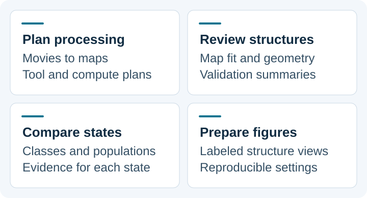

# BioSymphony CryoCore

[](LICENSE)
[](https://www.python.org/downloads/)
[](#quickstart)
[](#status)

CryoCore helps AI agents choose, call, and chain tools for cryo-electron
microscopy (cryo-EM). It combines a tool knowledge base, callable scripts,
workflow instructions, and checks for passing results between tools. Use it
for processing, structure analysis, validation, and rendering.

Your agent supplies the execution environment. CryoCore supplies tool records,
skills, command helpers, and checks for each handoff.


## What Your Agent Gains



[Tool records](references/software-registry.yaml) |
[Agent skills](skills/) |
[Callable tools](docs/tool-use-and-chaining.md#callable-tools) |
[Workflow modules](docs/module-catalog.md) |
[Validation checks](docs/validation-command-matrix.md)

## Tool Knowledge Base

The [registry](references/software-registry.yaml) contains more than 100 tool
and resource records. It records roles, source links, versions where known,
runtime requirements, license terms, smoke commands, and expected outputs.
Your agent can compare options and identify missing requirements before making
a call. A smoke command checks availability; processing needs a task-specific
invocation.

| Work | Examples covered by the registry |
| --- | --- |
| Movie processing and reconstruction | MotionCor3, Warp/M, RELION |
| AI picking and tomography | Topaz, OCTOPI, ETSAM |
| Atomic model building | ModelAngelo, CryoAtom2, EM3DFold |
| Map enhancement and validation | LocScale, DAQ, EMDA |
| Conformational analysis | cryoDRGN, DynaMight, RECOVAR |
| Rendering and viewers | PyMOL, ChimeraX, Mol*, Blender |

Each record carries its own readiness and licensing status. The
[September source review](docs/toolwatch-2026-09-22.md) tracks recent AI methods
and releases; the [adoption policy](docs/toolwatch-to-lane-policy.md) defines
what a candidate needs before execution.

## Tool Calling And Chaining

The agent reads the relevant skill, selects an available tool, and calls it
through its terminal or API tools. CryoCore's modules describe the inputs,
stages, and required outputs. The agent checks each result before using it
in the next call.


| Example chain | Support in this checkout |
| --- | --- |
| RCSB metadata and coordinates -> coordinate analysis -> SVG figures | Runnable CPU demo: `make demo-local` |
| Movie correction and CTF estimation -> picking -> reconstruction | [Processing contracts](modules/lane-modules/raw-to-map.v1.json); configure and install the selected scientific tools |
| Map and model -> PyMOL or ChimeraX -> figure checks | [Renderer helpers](scripts/cryocore/render/); requires the selected renderer and applicable terms |

The [tool-use guide](docs/tool-use-and-chaining.md) shows concrete calls and
how to connect them. Preserve input identifiers, file formats, units, and
coordinate frames between steps. Validate AI-generated maps and models against
original experimental evidence before interpreting added detail.

## Quickstart

Point your coding agent at `skills/cryocore/SKILL.md`, or follow the
[skill installation guide](docs/skill-installation.md). To run the local demo,
use Python 3.10 or later:

```bash
python3 -m venv .runtime/venv
. .runtime/venv/bin/activate
python3 -m pip install -r requirements-dev.txt
make demo-local
```

The demo fetches public RCSB metadata and coordinates, computes chain contacts
and ligand neighborhoods, and creates SVG figures. Open
`.runtime/t2r14-open-dossier/artifacts/report.html` to inspect the results.
See the [static preview](examples/t2r14-open-dossier-preview/) for an offline
example or the [quickstart](docs/public-quickstart.md) for output details.

## Agent Prompt

Replace `[my task]` with your goal. The [agent quickstart](docs/agent-quickstart.md)
uses the same prompt.

```text
Use CryoCore for [my task]. Read AGENTS.md, skills/cryocore/SKILL.md,
docs/tool-use-and-chaining.md, and the relevant software registry records.
Choose tools and explain why they fit. Build a sequence of calls with explicit
inputs and outputs. Run supported calls within my authorized scope, and check
each output before passing it to the next tool. If a tool is unavailable,
identify the missing requirement and continue independent steps.
Use paid compute, raw downloads, and gated tools only with explicit authorization.
Keep private data, secrets, logs, heavy data, weights, and license files out of
git and public outputs. Report the calls made, results, checks, and limitations.
```

## Status

Pre-alpha. Support varies by tool:

| Available here | Execution requirement |
| --- | --- |
| Metadata helpers, coordinate demo, schemas, and validators | Local Python; metadata fetching and the demo use public network access |
| PyMOL and ChimeraX helpers, FSC plotting | Installed renderer or plotting dependencies; review tool-specific terms |
| Raw processing, model building, and state-analysis workflows | Configured scientific runtimes and the declared inputs |
| Recent AI research candidates | Source, checkpoint, runtime, and independent-validation review |

Scientific software runs in separate environments. Keep private data, secrets,
raw data, maps, model weights, and heavy outputs outside git. Paid compute,
raw downloads, and gated tools require explicit operator authorization.

To check this checkout, run `make release-check REQUIRE_GITLEAKS=1` with
Gitleaks installed. Repository checks validate code and contracts; scientific
conclusions require results from actual runs.

## Further Reading

- [Recipes](docs/recipes/README.md) and [workflow modules](docs/module-catalog.md): compose a task.
- [Public data APIs](docs/public-accession-apis.md): find inputs and metadata.
- [Compute backends](docs/compute-backends.md): local, cloud, and HPC execution requirements.
- [Demo gallery](docs/demo-gallery.md): additional examples and outputs.
- [Tool terms](docs/tooling-and-licensing.md), [data policy](docs/data-policy.md), and [troubleshooting](docs/troubleshooting.md): resolve runtime and data constraints.
- [Contributing](CONTRIBUTING.md) and [public release checks](PUBLIC_RELEASE.md): maintain the toolkit.

[Tracker integration](docs/linear-orchestration.md) is optional. CryoCore can be
used directly by a terminal agent. Prediction and design belong to Structure
Factory; see the [ownership map](docs/move-duplicate-map.md).
