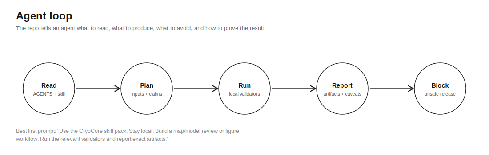

# Agent Quickstart

This repo is designed to be pointed at by a coding agent. The agent should use
the skills, docs, schemas, and validators to turn open-ended cryo-EM requests
into concrete map/model reviews, figure workflows, state-comparison plans,
provider plans, run reviews, and tracker-ready issue waves.




## Best First Prompt

This is the canonical CryoCore agent prompt. The README's
[Agent Prompt](../README.md#agent-prompt) section uses the same text.

```text
Use the CryoCore skill pack in this repo. Stay local. Read AGENTS.md,
README.md, docs/goal-orchestration.md, docs/workflows.md, docs/use-cases.md,
and the relevant skill under skills/. Build a useful cryo-EM map/model review,
figure workflow, state comparison, provider plan, or evidence package. Keep
private data, secrets, raw or heavy artifacts, provider logs, model weights,
and license files out of git and public outputs. Run the smallest relevant
validators first, then
`make release-check` when the task is release-readiness. Report exact
artifacts, claim levels, validation results, and residual risks.
```

## What The Agent Should Read

| Task | Skill |
| --- | --- |
| General CryoCore work | `skills/cryocore/SKILL.md` |
| Public release, privacy, or secrets | `skills/cryocore-public-safety/SKILL.md` |
| Map/model review | `skills/cryocore-map-model-dossier/SKILL.md` |
| Provider run review | `skills/cryocore-run-closeout/SKILL.md` |
| Tool/license audit | `skills/cryocore-toolwatch/SKILL.md` |
| Heterogeneity/state review | `skills/cryocore-heterogeneity-jury/SKILL.md` |
| Figure workflow | `skills/cryocore-figure-dossier/SKILL.md` |

## What The Agent Should Produce

- A declared input boundary.
- A goal brief when the request is broad enough to need orchestration.
- A claim ceiling using `docs/claim-levels.md`.
- Artifacts or templates under the right repo directory.
- Validation commands and results.
- Data, license, and provider-risk notes.
- A final outcome block shaped like `templates/final-outcome-block.md`.

## Minimum Acceptable Agent Run

For a public release or release-readiness review, an agent should at least:

1. Read `AGENTS.md`, `README.md`, this guide, and the relevant skill.
2. State whether the task is local-only, networked public metadata, or
   operator-gated provider work.
3. Run:

   ```bash
   make docs-link-check
   make skill-check
   make goal-brief-check
   make public-snapshot-check
   ```

4. For release readiness, also run:

   ```bash
   make release-check
   ```

5. Report blockers first, then changed files, validation results, claim ceiling,
   and residual risk.

An answer that only says a provider is running, a command exited, or a demo
looks good is incomplete.

## Starter Tasks

Use fixtures under `examples/agent-tasks/`:

- `public-safety-review.prompt.md`
- `map-model-dossier.prompt.md`
- `cloud-provider-prep.prompt.md`
- `linear-wave-planning.prompt.md`
- `goal-to-campaign.prompt.md`

## Local Validation Ladder

```bash
make doctor
make goal-brief-check
make skill-check
make runpod-scope-check
make provider-closeout-check
make release-check
```

See `docs/validation-command-matrix.md` for side effects and network behavior.
