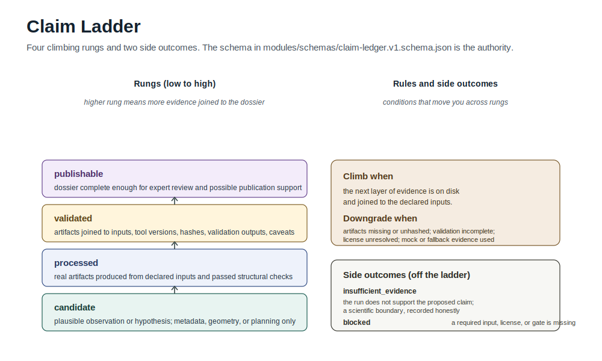

# Claim Levels

CryoCore keeps scientific claims bounded to the evidence that actually landed.

## Levels

`candidate`: A plausible observation or hypothesis. It may come from metadata, geometry, planning, or partial derived evidence. It is not validation.

`processed`: The repo or provider produced real processing artifacts from declared inputs, and those artifacts passed structural checks. Interpretation remains limited.

`validated`: Evidence has been joined to inputs, tool versions, artifact hashes, validation outputs, and caveats. This is still not a biological mechanism proof by itself.

`publishable`: A dossier is complete enough for expert review and possible publication support. It still requires human scientific review and any journal, institutional, or licensing requirements.

`insufficient_evidence`: The run does not support the proposed claim. This is a successful scientific boundary, not a software failure.

`blocked`: The claim cannot be evaluated because a required input, license, tool, provider artifact, cost record, cleanup proof, or review gate is missing.

## Required Claim Ledger Fields

Each claim should record:

- claim text
- claim level
- evidence artifact
- source inputs
- caveat or weakness
- reviewer status when applicable

## Downgrade Triggers

Downgrade or block a claim when:

- output is mock, dry-run, fixture, metadata-only, planned-only, or screenshot-only
- provider status is intent-only
- expected artifacts are missing
- hashes are missing or mismatched
- license posture is unresolved
- fallback occurred without explicit claim downgrade
- raw data, map, model, or validation artifact was not actually fetched or produced

## Related

- [No-False-Success Hardening](no-false-success-hardening.md): the enforcement rules that pair with this ladder.
- [Data Policy](data-policy.md): which inputs and outputs are allowed at each tier.
- [Glossary](glossary.md): definitions for the orchestration vocabulary used in claim ledgers.
- [Claim Ledger schema](../modules/schemas/claim-ledger.v1.schema.json): machine-readable contract for claim records.
- [Final Outcome Block template](../templates/final-outcome-block.md): the worker-outcome shape that records a claim level on a Linear issue.
- [Recipe: Map/Model Dossier](recipes/map-model-dossier.md): an end-to-end recipe whose ceiling decisions follow this ladder.
