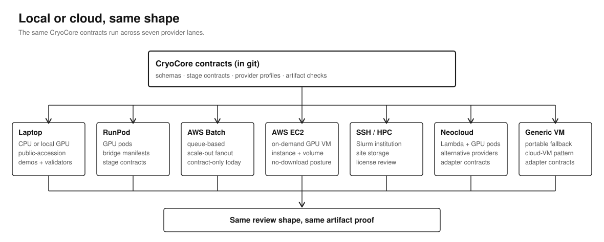

# Compute Backends

CryoCore treats compute backends as execution planes. Durable contracts, stage
ledgers, artifact hashes, and claim ledgers live in this repository or in
fetched closeout artifacts. This keeps run evidence inspectable across
execution environments.



## Provider Roles

| Provider | Role | Default posture |
| --- | --- | --- |
| local | Prep, validators, tiny public-safe demos, GUI review. | No paid mutation. |
| RunPod | Reference paid pod provider for no-download and map/model demos. | Requires operator gate, digest-pinned image or approved bootstrap, artifact fetch/hash, cost report, and cleanup proof. |
| AWS Batch | Future scale-out backend after provider adapter parity. | Contract-only until explicit implementation issue. |
| SSH/HPC | Institutional or Slurm execution route. | Requires site-specific data, license, and storage review. |
| generic cloud VM | Portable cloud fallback pattern. | Contract-only until an adapter issue owns the route. |
| neocloud GPU pod | Alternative GPU pod pattern (e.g. Lambda, other neocloud GPU providers). | Contract-only until an adapter issue owns the route. |

## Choose A Backend

| If you need... | Choose | Why |
| --- | --- | --- |
| A first safe run | `local` | No paid mutation or provider credentials. |
| A public pod demo or GPU smoke | `RunPod` | Reference pod-style path with public manifests and stage contracts. |
| Repeated cloud fanout later | `AWS Batch` | Queue-based scale after adapter parity exists. |
| Institutional compute | `SSH/HPC` | Fits site-managed Slurm, storage, and license controls. |
| Provider portability | `generic cloud VM` or `neocloud` (e.g. Lambda) | Adapter contracts for environments outside the reference RunPod path. |

Use [Workflow Blueprints](workflows.md#4-provider-prep-and-cloud-launch-request)
and [Provider Readiness](provider-readiness.md) before asking an agent to
prepare cloud work.

## Backend Contract

Every provider route must record:

- provider profile and execution profile
- operator gate and budget for paid or mutating work
- exact repository revision and image digest or bootstrap provenance
- stage-progress ledger
- provider run record with actual runtime status
- artifact pull report and hash ledger
- cleanup proof
- cost report when paid compute was used

A scientific claim closes when joined inputs, materialized artifacts,
validation reports, and an explicit claim level are all on disk alongside the
provider allocation record, status, and command exit.

## Custom Providers

The provider profiles in `modules/provider-profiles/` are examples. For a
different compute environment, create a custom profile against the same schema.
The repository does not limit the agent to a fixed provider list.

A custom profile is a JSON file with the fields listed in the Backend Contract
section above: `provider`, `provider_class`, `profile_id`, `workspace_root`,
`artifact_root`, `secret_mode`, `operator_gate_required`, GPU and storage
posture, image map (or bootstrap pointer), and `execution_ready_requires`.
Reference existing profiles such as
`modules/provider-profiles/cloud-vm/generic-gpu-vm-no-download.v1.json` or
`modules/provider-profiles/ssh-hpc/slurm-no-download.v1.json` when drafting
your own.

Once a custom profile exists, the rest of the doctrine applies unchanged:

- `make provider-check` validates the profile shape.
- The stage contract, stage-progress ledger, artifact pull report, cost
  report, cleanup proof, and claim ledger requirements are provider-neutral.
- `docs/no-false-success-hardening.md` and `scripts/cryocore/provider_*.py`
  treat any provider's "running" state as intent until artifacts and closeout
  join the run.

Example custom profiles:

- An on-prem GPU server with bespoke storage layout.
- A university SLURM allocation with site-specific module load commands.
- A neocloud or sovereign cloud account not represented in the example set.
- A hybrid pattern where prep runs locally and one stage offloads to a
  short-lived GPU pod.

Do not commit a custom profile that contains private hostnames, credentials,
project IDs, or other operator-private content. Public-safe profiles can live
in a fork or downstream repository.

## Cloud Resource Workflow

1. Pick a provider profile from `modules/provider-profiles/`.
2. Pick an execution profile and stage contract.
3. Declare data tier, artifact root, storage location, budget, and cleanup rule.
4. Run local contract validation.
5. Generate only a prep-mode launch request unless an operator explicitly gates
   paid or mutating provider work.
6. Fetch artifacts after execution and use them as evidence of what ran.
7. Run closeout checks and downgrade the claim if any evidence is missing.

Local prep commands:

```bash
make provider-check
make runpod-check
make runpod-scope-check
make launch-preflight-prep
```

Use `make launch-preflight-real` only when an operator checks execution-ready
state. It is expected to fail for public prep manifests until the repository
revision is a 40-character commit SHA, the image is digest-pinned or the
bootstrap is audited, credentials are provided outside git, and launch
authorization is set.

Cloud resources that must stay outside the public repo include credentials,
secret names with sensitive values, billing records, provider IDs that identify
private work, raw provider logs, license files, signed URLs, raw data, maps,
half-maps, model weights, and generated heavy outputs.

## Related

- [Provider Execution Model](provider-execution-model.md): why provider state is intent until artifacts and closeout join the run.
- [Provider Readiness](provider-readiness.md): readiness levels and operator-handoff steps per provider.
- [RunPod Stack](runpod-stack.md): RunPod-specific manifests, image families, and entrypoints.
- [Workflow Blueprints: Provider Prep](workflows.md#4-provider-prep-and-cloud-launch-request): the workflow this backend selection feeds into.
- [Recipe: Provider Closeout](recipes/provider-closeout.md): runnable closeout review against fixture artifacts.
