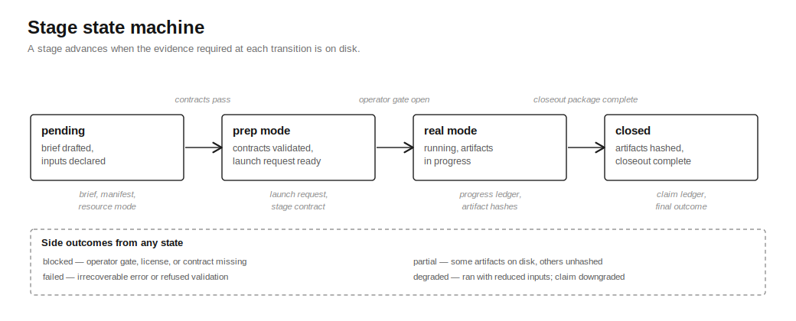

# Provider Execution Model

CryoCore treats compute providers as execution planes. The source of truth lives in fetched artifacts and the contracts in this repo.

## Provider Roles

- `local`: dry-run, contract checks, small public demos, and fixture validation.
- `runpod`: first paid GPU/pod execution target after explicit operator authorization.
- `aws_batch`: scale path after adapter parity with the same artifact and closeout contract.
- `ssh_hpc`: institutional or Slurm execution where artifacts can be fetched and hashed.
- `generic_cloud` and `neocloud`: compatible only when they preserve the same ledgers and gates.

## Launch Is Intent

A provider allocation, pod ID, queue state, port mapping, or `RUNNING` status is only intent. It cannot close a CryoCore claim.

Minimum execution evidence:

- provider actual status and runtime uptime
- image pull success or failure
- `stage-progress.jsonl` heartbeat and terminal events
- executed-command ledger
- input audit
- contract self-check
- artifact pull report
- cost report for paid providers
- cleanup proof for ephemeral paid resources
- artifact hashes joined to declared expected artifacts

## Public Manifests

Public launch manifests are reviewable contracts. They may use placeholder public images or prep-only tags so the structure is inspectable without publishing private infrastructure.

Execution-ready manifests must additionally prove:

- digest-pinned images or a verified bootstrap route
- public, fetchable, 40-character commit SHA
- current runtime credential references outside git
- operator approval for spend, data transfer, and cleanup
- license posture for each gated tool

## Fallback Policy

Fallbacks are allowed only when declared. If a run changes provider, image route, dataset, tool path, or evidence mode, closeout must be downgraded to `partial`, `degraded`, `blocked`, or `failed` unless the stage contract explicitly permits the fallback and the claim ledger reflects it.

## Related

- [Provider Readiness](provider-readiness.md): operator gates and authorization shape per provider.
- [Compute Backends](compute-backends.md): mapping from CryoCore workloads to provider shapes.
- [RunPod Stack](runpod-stack.md): RunPod-specific bridge, manifests, and entrypoints.
- [No-False-Success Hardening](no-false-success-hardening.md): the closeout discipline this model enforces.
- [Recipe: Provider Closeout](recipes/provider-closeout.md): runnable closeout review against fixture artifacts.
