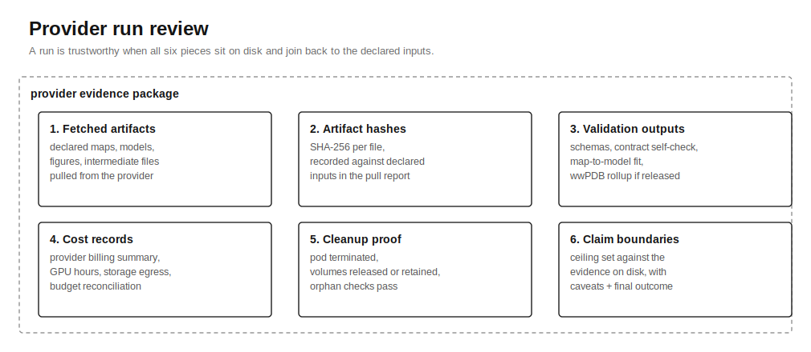

# Recipe: Provider Run Review



## Inputs

- Provider-run JSON.
- Pulled artifact root.
- Stage contract and launch manifest when available.

## Commands

```bash
python3 scripts/cryocore/provider_closeout_check.py \
  --provider-run tests/fixtures/provider-closeout/good/provider-run.json \
  --artifact-root tests/fixtures/provider-closeout/good/artifacts \
  --execution-mode real \
  --json
```

## Files Required

- `stage-progress.jsonl`
- `validation/stage-contract-check.json`
- `validation/input-audit.json`
- `validation/contract-self-check.json`
- `artifact_hashes.json`
- `cost_report.json`
- `cleanup_proof.json`
- `claim_ledger.json`

## Claim Ceiling

No provider result may exceed the evidence mode and claim ledger. Provider
state is not scientific success.

## Validation

```bash
make provider-closeout-check
```

## Failure Handling

When terminal stages, hashes, cleanup, or cost evidence are missing, report the
run as `blocked`, `failed`, `partial`, or `degraded` and record the gap
honestly.

## Related

- [No-False-Success Hardening](../no-false-success-hardening.md): the artifact-review discipline this recipe enforces.
- [Linear template: Paid Provider Run](../../templates/linear-paid-provider-run.md): tracker-ready issue shape for paid provider work, where this recipe closes the loop.
- [Run Review skill](../../skills/cryocore-run-closeout/SKILL.md): the skill an agent loads to run this recipe.
- [Validation Command Matrix](../validation-command-matrix.md): which validator to reach for first when a provider artifact is missing.
- [Provider Run schema](../../modules/schemas/provider-run.v1.schema.json): contract for the provider-run JSON input.
