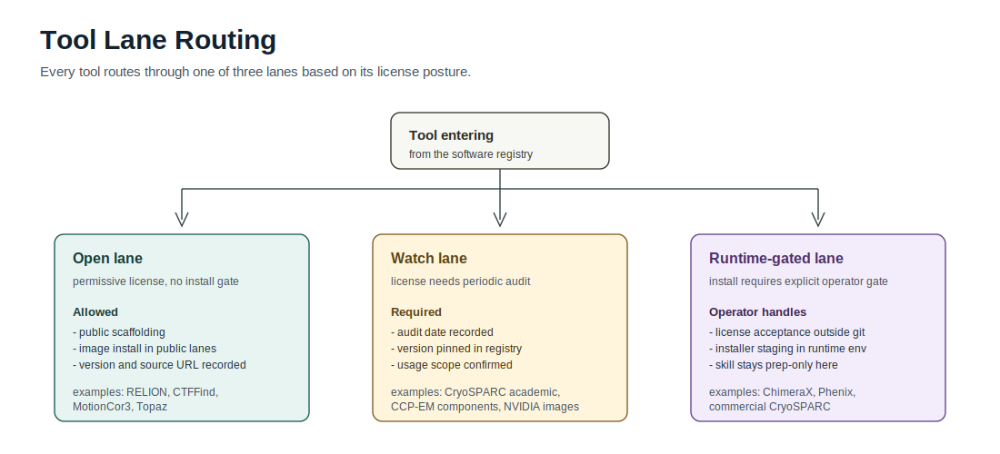

# Tooling And Licensing

Last reviewed: 2026-05-27

This is the public, human-readable tool posture for BioSymphony CryoCore. It complements the machine-readable registry at `references/software-registry.yaml`.

This is engineering policy, not legal advice.

## Open-Default Candidates

These are default candidates for public scaffolding or public images after normal notices, citations, dependency review, and source-compliance:

- RELION, currently audited against RELION 5.0.1.
- Warp/M/WarpTools, currently audited against v2.0.0dev39. The current v2 dev lane requires CUDA 12.9/.NET 10 and declares RELION 5 compatibility.
- MotionCor3 from the CZI BSD-3-Clause source repository.
- Topaz, with GPL/source-compliance handling.
- CryoSPARC Tools for metadata export only when the underlying CryoSPARC access is already cleared.
- ModelAngelo code. Keep large weights in runtime caches or reviewed image layers with hashes.
- CryoAtom2 code. Keep ESM, RNA-FM, and CryoAtom weights in runtime caches or reviewed image layers with hashes.
- cryoDRGN, with GPL-3.0 source-compliance and dependency review.
- DynaMight, with RELION-compatible input capture and independent validation.
- AreTomo3, DenoisET, and copick for bounded cryo-ET preprocessing, denoising, and annotation projects.
- Coot open-source builds, gemmi, mrcfile, starfile, pyem, NumPy/SciPy/Pandas.
- Mol*, Blender, and open-source PyMOL builds for public-safe visualization where terms permit.

Policy snippet for open/planned tools:

> CryoCore may include open-source tool source builds or package installs in public scaffolding only when the exact version, upstream URL, license class, citation, and image source-compliance notes are recorded. Open/planned status does not permit committing raw movies, maps, half-maps, model weights, license files, gated installers, private URLs, or accepted-license records.

## Review-Required

These can be useful and can be mentioned publicly, but image inclusion or execution requires exact current terms/build review:

- CTFFIND.
- cisTEM.
- EMAN2.
- Scipion/Xmipp and plugin stacks.
- Easymode pretrained models.
- MissAlignment.
- EMReady2 and other map-enhancement models.
- CryoARC, CryoHype, CryoPANDA, and Cas9 benchmark datasets until data size, access terms, and example runs are pinned.
- CryoDECO, CryoFSL, ParSeek, and StructAgent until model weights, checkpoints, datasets, and linked third-party tools are pinned.
- WebCalEM or other hosted calibration tools when upload behavior is involved.
- DeepEMhancer, especially model-weight redistribution.
- GNINA or other cross-domain tools if pulled into a map/model validation lane.
- CUDA/NVIDIA base images and drivers under current NVIDIA container terms.
- Large public weights, maps, databases, or reference bundles even when redistribution is technically permitted.

Policy snippet for watch tools:

> `watch` means documentation and dry-run placeholders are allowed, but public image inclusion is blocked until the exact artifact, license, redistribution right, dependency license, and commercial/noncommercial use context are reviewed. Watch tools may be installed at runtime only when the operator records the source URL, version, checksum, use context, and no-secret/no-license-file posture outside git.

## Runtime-Gated

These may have public docs, gates, and runtime placeholders, but should not be baked into public images without explicit operator/license posture:

- CryoSPARC.
- CryoWizard, because execution inherits CryoSPARC access, project data, model posture, and secret-handling gates.
- Phenix.
- ChimeraX, currently tracked as ChimeraX 1.11 / staged 1.11.1 package posture. Noncommercial use or commercial license posture must be recorded per campaign.
- MotionCor2 UCSF binary.
- crYOLO.
- Gctf unless redistributable current terms are confirmed.
- RECOVAR current upstream main, because it identifies a Princeton academic/noncommercial license; older PyPI 0.4.5 was GPLv3, so exact version and use context are required.
- CryoREAD, DiffModeler, ComplexModeler, DAQ, and other Kihara tools unless the exact tool and use context are separately cleared.
- Schrodinger/Incentive PyMOL binaries and license files.

Policy snippet for gated tools:

> `gated` tools require explicit operator authorization before execution. CryoCore may track module contracts, smoke commands, and expected artifacts, but must not redistribute installers or binaries unless a current license explicitly permits it. Runtime gates must fail closed before large downloads or paid provider mutation when access, license posture, or use context is missing.

## Second-Wave Red Flags

The following red flags were source-backed on 2026-05-15 and refreshed on 2026-05-27. They should drive registry status:

- CryoSPARC: noncommercial academic license, no copying/distribution/third-party use, and usage/performance/license telemetry language. Status: `gated`.
- Phenix: no-cost for non-profit work, for-profit users through the Phenix Industrial Consortium, and download requires license-term agreement. Status: `gated`.
- ChimeraX: no-cost noncommercial download requires agreement; commercial use requires a separate written license. Status: `gated`.
- CCP-EM: the suite has a single governing license plus component-specific terms; additional redistributed packages are not covered by the suite license. Status: `gated` until per-component image posture is reviewed.
- CTFFIND and cisTEM: Janelia-license posture is not the same as generic open-source packaging; exact CTFFIND major version and cisTEM binary/source terms must be recorded. Status: `watch`.
- Kihara suite tools: mixed posture across tools; Emap2sec advertises GPLv3 while also limiting free use to academic/noncommercial users and directing commercial users to alternate licensing. Status: `gated` unless a specific tool is separately cleared.
- RECOVAR current main: Princeton academic/noncommercial terms; do not assume old PyPI GPL posture applies to current source. Status: `gated`.
- crYOLO: complimentary science license covers software and pretrained weights, limits use to noncommercial academic/research purposes, prohibits commercial/operational use, and restricts copying/distribution. Status: `gated`.
- VMD/NAMD/MDFF: VMD and NAMD are noncommercial-use licensed and commercial use requires a commercial license; MDFF lanes inherit VMD/NAMD packaging gates. Status: `gated`.
- NVIDIA CUDA/base images: acceptable as a common runtime base only after the current NVIDIA container EULA and image tag are recorded; CUDA images are proprietary runtime artifacts, not open-source dependencies. Status: `watch`.
- Large model weights from CryoAtom, ModelAngelo, CryoFM, and Cryo-IEF: weights are heavy runtime artifacts, may have terms distinct from code, and must live in runtime caches, provider volumes, private reviewed image layers, or fetched artifacts with hashes. Status: `watch` for weight packaging even when code is open/planned.
- Derived maps from EMReady2, DenoisET, CryoFM, DeepEMhancer, or similar methods are not original experimental maps. They require original-map joins, weight hashes, parameters, and independent validation before supporting stronger claims.
- Public benchmark datasets such as cryoPANDA, engineered Cas9 heterogeneity data, CZDP tilt series, EMPIAR raw movies, and CryoBench must be tracked as external data. Keep metadata pointers in git, not the data.

## Shared With Structure Factory

ChimeraX is intentionally duplicated with Structure Factory. Generic parser and visualization posture such as gemmi, Mol*, Blender, and open-source PyMOL may also appear in both repos when Structure Factory needs deposited-structure or design-candidate figures.

Cryo-specific model-building, reconstruction, and refinement posture such as ModelAngelo, Coot, Phenix, RELION, Warp/M, MotionCor, CryoSPARC, cryoDRGN, and RECOVAR belongs in CryoCore unless a cross-repo issue explicitly consumes finished CryoCore outputs as comparison evidence. The repos should synchronize source-backed audit dates only for genuinely shared tools, not force all workflows through one image or registry.

## Related

- [License Scope](license-scope.md): the repo-level license boundary that pairs with this tool posture.
- [Toolwatch To Lane Policy](toolwatch-to-lane-policy.md): how `watch` and `gated` tools move into a runtime lane.
- [ChimeraX Shared Posture](chimerax-shared-posture.md): the cross-repo ChimeraX policy referenced above.
- [Glossary](glossary.md): one-liner reference for the tools listed here.
- [Software Registry](../references/software-registry.yaml): machine-readable posture entries for each tool.
- [Recipe: Toolwatch Audit](recipes/toolwatch-audit.md): how to update this posture from a primary-source audit.
