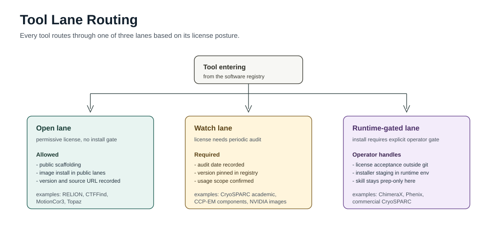

# Tooling And Licensing

Last reviewed: 2026-05-27

Latest focused tool audit: 2026-08-30

This document defines the public tool posture for BioSymphony CryoCore. The
machine-readable record is `references/software-registry.yaml`.

This is engineering policy, not legal advice.

## Open-Default Candidates

These tools are candidates for public scaffolding or public images. Before use,
record the required notices and citations, review dependencies, and confirm
source compliance.

- RELION, audited against version 5.0.1.
- Warp/M/WarpTools, audited against version 2.0.0dev39. This development lane requires CUDA 12.9 and .NET 10. Upstream declares compatibility with RELION 5.
- MotionCor3 from the CZI BSD-3-Clause source repository.
- Topaz, with GPL/source-compliance handling.
- CryoSPARC Tools for metadata export only when the underlying CryoSPARC access is already cleared.
- ModelAngelo code. Keep large weights in runtime caches or reviewed image layers with hashes.
- CryoAtom2 code. Keep ESM, RNA-FM, and CryoAtom weights in runtime caches or reviewed image layers with hashes.
- cryoDRGN 4.3.1, with GPL-3.0 source-compliance, dependency review, trusted-pickle artifact boundaries, and localhost-only dashboard posture.
- DynaMight, with RELION-compatible input capture and independent validation.
- AreTomo3 2.2.2, GCtfFind 1.0.0, DenoisET, and copick for bounded cryo-ET preprocessing, CTF estimation, denoising, and annotation projects.
- Servalcat 0.4.142 for open-source refinement and validation modes. Refmac or CCP4-backed modes inherit their separate gates.
- Coot open-source builds, gemmi, mrcfile, starfile, pyem, NumPy/SciPy/Pandas.
- Mol*, Blender, and open-source PyMOL builds for public-safe visualization where terms permit.

Policy snippet for open/planned tools:

> CryoCore can include an open-source build or package in public scaffolding
> only after the registry records its exact version, upstream URL, license
> class, citation, and image source-compliance notes. Open or planned status
> does not permit commits of raw movies, maps, half-maps, model weights, license
> files, gated installers, private URLs, or accepted-license records.

## Review-Required

These tools can appear in public documentation. Review the exact terms and
build before image inclusion or execution.

- CTFFIND.
- cisTEM.
- EMAN2.
- Scipion/Xmipp and plugin stacks.
- ASPIRE-Python for synthetic fixtures, covariance baselines, and known-answer benchmark checks.
- Miffi 1.0.1 for micrograph quality filtering, pending model/checkpoint, training-data, and serialized-output posture.
- EMAN2 e2gmm as a heterogeneity second-opinion lane, pending EMAN2 subtool/runtime review.
- MAVEn as a downstream cryoDRGN ensemble-analysis protocol. Upstream documents compatibility with cryoDRGN 0.3.2 and dependencies on RELION, Chimera, and ChimeraX. Review lane compatibility and inherited gates before use.
- MonoRes, MonoDir, and FSC-Q through Scipion/Xmipp for local-resolution and local map/model-fit validation.
- Easymode pretrained models.
- MissAlignment.
- EMReady2 and other map-enhancement models.
- CryoARC, CryoHype, CryoPANDA, and Cas9 benchmark datasets until data size, access terms, and example runs are pinned.
- CryoDECO, CryoFSL, ParSeek, and StructAgent until model weights, checkpoints, datasets, and linked third-party tools are pinned.
- WebCalEM or other hosted calibration tools when upload behavior is involved.
- DeepEMhancer, especially model-weight redistribution.
- GNINA or other cross-domain tools if pulled into a map/model validation lane.
- CUDA/NVIDIA base images and drivers under current NVIDIA container terms.
- Large public weights, maps, databases, or reference bundles even when redistribution is technically permitted.
- InSilicoTEM and other TEM simulation tools until explicit license, MATLAB/DIPimage, and fixture redistribution posture are clear.
- OPUS-ET Agent, CoCryoViS, and CryoLithe while their young interfaces, upload/data boundaries, dependencies, model weights, and validation posture are evaluated.

Policy snippet for watch tools:

> `watch` permits documentation and dry-run placeholders. It blocks public
> image inclusion until reviewers check the exact artifact, license,
> redistribution right, dependency licenses, and use context. Install a watch
> tool at runtime only after the operator records the source URL, version,
> checksum, and use context outside git. Do not store secrets or license files
> in git.

## Runtime-Gated

These tools can have public documentation, gates, and runtime placeholders. Do
not include them in a public image without an explicit operator and license
review.

- CryoSPARC, tracked at version 5.0.7.
- CryoWizard, because execution inherits CryoSPARC access, project data, model posture, and secret-handling gates.
- Phenix.
- ChimeraX 1.11, with package version 1.11.1 staged for review. Record noncommercial use or a commercial license for each campaign.
- MotionCor2 UCSF binary.
- crYOLO.
- Gctf unless redistributable current terms are confirmed.
- RECOVAR upstream `main`, which identifies a Princeton academic/noncommercial license. PyPI version 0.4.5 used GPLv3. Record the exact version and use context.
- ResMap, because public source advertises a noncommercial/no-derivatives Creative Commons license posture.
- FlyTomo, because upstream limits use to academic and noncommercial research and prohibits binary redistribution or modification without permission.
- CryoREAD, DiffModeler, ComplexModeler, DAQ, and other Kihara tools unless the exact tool and use context are separately cleared.
- Schrodinger/Incentive PyMOL binaries and license files.

Policy snippet for gated tools:

> `gated` tools require explicit operator authorization before execution.
> CryoCore may track module contracts, smoke commands, and expected artifacts.
> Do not redistribute installers or binaries unless the applicable license
> explicitly permits it. Runtime gates must fail closed before large downloads
> or paid provider changes when access, license posture, or use context is
> missing.

## Second-Wave Red Flags

The following broad red flags were source-backed on 2026-05-15 and reviewed on
2026-05-27. Focused release and repository facts added later are recorded in the
dated toolwatch notes and software registry. They do not imply that every term
below was re-reviewed on the later date.

- CryoSPARC: noncommercial academic license, no copying/distribution/third-party use, and usage/performance/license telemetry language. Status: `gated`.
- Phenix: no-cost for non-profit work, for-profit users through the Phenix Industrial Consortium, and download requires license-term agreement. Status: `gated`.
- ChimeraX: A no-cost noncommercial download requires agreement. Commercial use requires a separate written license. Status: `gated`.
- CCP-EM: The suite has a governing license and component-specific terms. The suite license does not cover additional redistributed packages. Status: `gated` until each image component is reviewed.
- CTFFIND and cisTEM: The Janelia-license posture differs from generic open-source packaging. Record the CTFFIND major version and the cisTEM binary or source terms. Status: `watch`.
- Kihara suite tools: Terms differ across tools. Emap2sec advertises GPLv3, limits free use to academic and noncommercial users, and directs commercial users to alternate licensing. Status: `gated` unless the specific tool is cleared.
- RECOVAR upstream `main`: Princeton academic/noncommercial terms apply. Do not apply the older PyPI GPL posture to this source. Status: `gated`.
- crYOLO: complimentary science license covers software and pretrained weights, limits use to noncommercial academic/research purposes, prohibits commercial/operational use, and restricts copying/distribution. Status: `gated`.
- VMD/NAMD/MDFF: VMD and NAMD use noncommercial licenses. Commercial use requires a commercial license. MDFF lanes inherit the VMD and NAMD packaging gates. Status: `gated`.
- NVIDIA CUDA/base images: Record the applicable NVIDIA container EULA and image tag before using an image as a runtime base. CUDA images are proprietary runtime artifacts, not open-source dependencies. Status: `watch`.
- Large model weights from CryoAtom, ModelAngelo, CryoFM, and Cryo-IEF: weights are heavy runtime artifacts, may have terms distinct from code, and must live in runtime caches, provider volumes, private reviewed image layers, or fetched artifacts with hashes. Status: `watch` for weight packaging even when code is open/planned.
- Derived maps from EMReady2, DenoisET, CryoFM, DeepEMhancer, or similar methods are not original experimental maps. They require original-map joins, weight hashes, parameters, and independent validation before supporting stronger claims.
- Public benchmark datasets such as cryoPANDA, engineered Cas9 heterogeneity data, CZDP tilt series, EMPIAR raw movies, and CryoBench must be tracked as external data. Keep metadata pointers in git, not the data.
- Serialized Python artifacts, including cryoDRGN and Miffi pickle outputs, are untrusted inputs. Load them only from reviewed sources and record their hashes. Never accept them from an untrusted public upload path.

## Shared With Structure Factory

ChimeraX is intentionally duplicated with Structure Factory. Generic parser and visualization posture such as gemmi, Mol*, Blender, and open-source PyMOL may also appear in both repos when Structure Factory needs deposited-structure or design-candidate figures.

Cryo-specific model-building, reconstruction, and refinement posture such as ModelAngelo, Coot, Phenix, RELION, Warp/M, MotionCor, CryoSPARC, cryoDRGN, and RECOVAR belongs in CryoCore unless a cross-repo issue explicitly consumes finished CryoCore outputs as comparison evidence. The repos should synchronize source-backed audit dates only for genuinely shared tools, not force all workflows through one image or registry.

## Related

- [License Scope](license-scope.md): the repo-level license boundary that pairs with this tool posture.
- [Toolwatch To Lane Policy](toolwatch-to-lane-policy.md): how `watch` and `gated` tools move into a runtime lane.
- [ChimeraX Shared Posture](chimerax-shared-posture.md): the cross-repo ChimeraX policy referenced above.
- [Proteus](https://github.com/jvogan/proteus): companion skill pack for agent-driven PyMOL and ChimeraX workflows beyond figure prep.
- [Glossary](glossary.md): one-liner reference for the tools listed here.
- [Software Registry](../references/software-registry.yaml): machine-readable posture entries for each tool.
- [Recipe: Toolwatch Audit](recipes/toolwatch-audit.md): how to update this posture from a primary-source audit.
