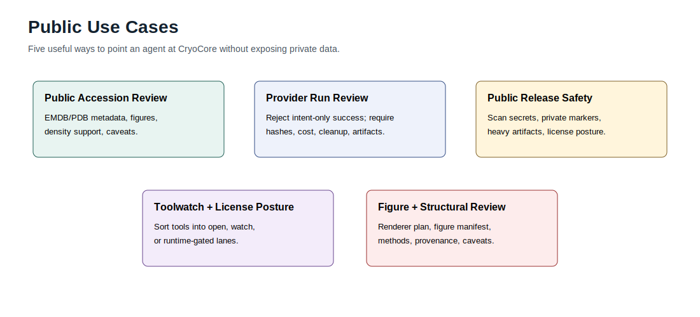

# Use Cases

CryoCore is most useful when you point an agent at the repo and ask it to
produce a concrete scientific output: a map/model review, figure plan,
state-comparison plan, provider plan, run review, issue wave, or tool posture
update. The examples below are designed to create useful outputs a newcomer can
inspect and adapt.



## 1. Public Accession Review

Use when you have a released EMDB/PDB pair and want a small evidence packet
with inputs, map/model summaries, density-support notes, figures, provenance,
and claim boundaries.

Prompt:

```text
Use the CryoCore skill pack. Stay local unless public accession metadata is
needed. Build a map/model review plan for EMDB <id> and PDB <id>. Include
declared inputs, density and model questions, expected artifacts, figures,
validation commands, claim boundaries, non-claims, and any data or license
gates.
```

Good outputs:

- input audit
- map/model or coordinate summary
- figure list
- claim-boundary note, such as `claim_ledger.md` or `claim_ledger.json`
- validation command list

Run locally:

```bash
make demo-local
```

Recipe: [Map/Model Dossier](recipes/map-model-dossier.md).

## 2. Provider Run Review

Use when a cloud or HPC run claims success and you need to reject intent-only
evidence.

Prompt:

```text
Use the CryoCore run-closeout skill. Review this provider run locally. Do not
trust provider status by itself. Require stage progress, input audit,
contract-self-check, artifact hashes, cost report, cleanup proof, and claim
boundaries. Return blockers first.
```

Good outputs:

- run status
- missing artifacts
- hash mismatches
- cost or cleanup blockers
- allowed claim level

Run locally:

```bash
make provider-closeout-check
```

Recipe: [Provider Run Review](recipes/provider-closeout.md). Prompt fixture: [Provider Run Review](../examples/agent-tasks/provider-closeout.prompt.md).

## 3. Public Release Readiness Review

Use before publishing a repo or handing an agent a public skill pack. This is a
release-quality pass across docs, examples, manifests, demos, validators, and
repo hygiene.

Prompt:

```text
Use the CryoCore public-safety skill. Stay local. Review this checkout for
public release readiness: README clarity, onboarding docs, examples, diagrams,
secret scans, private markers, heavy artifacts, license posture, bridge
manifests, issue templates, demos, and claim boundaries. Run the relevant
validators and summarize remaining release risk.
```

Good outputs:

- public snapshot report
- bridge manifest scope report
- missing release files
- release blockers
- final release gate result

Run locally:

```bash
make release-check
```

## 4. Toolwatch And License Posture

Use when a new cryo-EM tool, preprint, model, or API should be added without
overstating redistribution or execution rights.

Prompt:

```text
Use the CryoCore toolwatch skill. Classify this tool for public CryoCore:
open-default, watch, or runtime-gated. Record current source, version, license
class, install posture, weight/data policy, and what claims or execution are
allowed in the public repo.
```

Good outputs:

- registry entry draft
- license caveats
- install or image posture
- lane recommendation
- review date

Run locally:

```bash
make registry-check
make tooling-freshness-check
```

Recipe: [Toolwatch Audit](recipes/toolwatch-audit.md).

## 5. Figure And Structural Review

Use when structural figures need provenance, renderer selection, reproducible
captions, and claim labels.

Prompt:

```text
Use the CryoCore figure-dossier skill. Design a figure workflow for this
deposited structure or map/model result. Include renderer route, figure
manifest, input provenance, methods text, non-claims, and validation commands.
```

Good outputs:

- figure manifest
- methods/provenance text
- renderer license posture
- claim boundaries
- reproducibility checklist

Run locally:

```bash
make figure-manifest-check
```

Recipe: [Figure Dossier](recipes/figure-dossier.md).

## 6. Cloud Provider Prep

Use when a task may need RunPod, AWS, SSH/HPC, or another compute backend, and
you want the provider contract, launch-request shape, artifact plan, budget
gate, and artifact-review requirements ready before a run.

Prompt:

```text
Use the CryoCore skill pack. Prepare a provider workflow plan for <provider>.
Stay in prep mode. Include provider profile, execution profile, stage contract,
artifact root, operator gate, budget/cleanup requirements, validation commands,
blockers, and residual risks. Do not launch paid resources, touch credentials,
download raw data, or install gated tools.
```

Good outputs:

- selected provider profile
- launch-request prep plan
- stage contract and expected artifacts
- budget, storage, image, license, and cleanup gates
- artifact-review requirements

Run locally:

```bash
make provider-check
make runpod-check
make runpod-scope-check
make launch-preflight-prep
```

Prompt fixture: [Cloud Provider Prep](../examples/agent-tasks/cloud-provider-prep.prompt.md).

## 7. Linear Issue Wave

Use when a campaign should be split into bounded tracker issues for agents or
maintainers. The templates are Linear-shaped, but the sections work in any
tracker.

Prompt:

```text
Use the CryoCore skill pack. Plan a Linear-style issue wave for <campaign>.
Read the issue DAG and tracker orchestration docs. Keep future and cost-bearing
work in Backlog. Activate only the first local/prep wave. Include dependencies,
provider/gate/risk labels, operator gates, validation commands, and final
outcome block requirements.
```

Good outputs:

- issue DAG or wave table
- issue titles and dependencies
- provider, gate, risk, and wave labels
- validation commands per issue
- explicit operator-gated tasks

Run locally:

```bash
make issue-check
```

Prompt fixture: [Linear Wave Planning](../examples/agent-tasks/linear-wave-planning.prompt.md).

See [Workflow Blueprints](workflows.md) for the full path from local prep to
cloud run review.

## Boundaries That Keep Work Reusable

- Do not commit raw movies, maps, half-maps, particle stacks, private
  structures, model weights, license files, provider logs, or credentials.
- Do not treat a pod state, job ID, or command exit as scientific success.
- Do not run license-gated tools without an operator-owned gate outside git.
- Do not convert a candidate structural observation into a mechanism claim
  without evidence.
