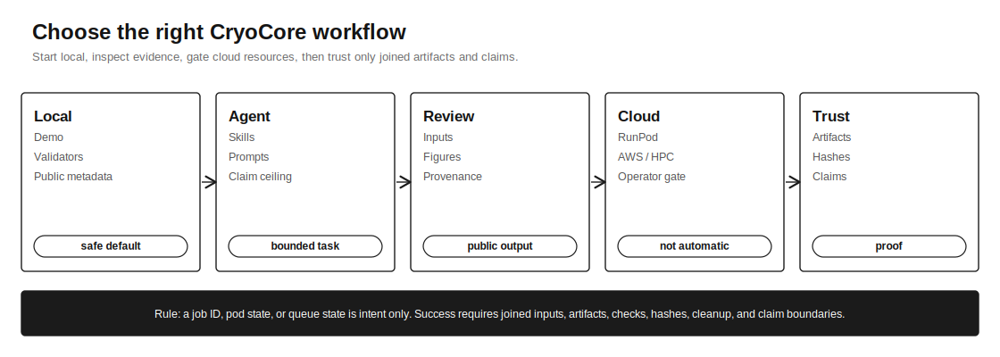

# Workflow Blueprints

CryoCore's superpowers are reusable scientific workflows with a contract-backed
trust layer: declared inputs, map/model review steps, figure and state outputs,
allowed compute, expected artifacts, validation commands, claim ceilings, and
provider evidence. Use this page to choose the right workflow before asking an
agent or operator to act.



## Pick A Workflow

| Goal | First command | Side effects | Reads first | Produces | Claim ceiling |
| --- | --- | --- | --- | --- | --- |
| See the repo work | `make demo-local` | public RCSB/mmCIF fetch, writes `.runtime/` | [Public Quickstart](public-quickstart.md) | Small structure review from public coordinate data | `processed` demo evidence |
| Hand work to an agent | `make skill-check` | no network or provider mutation | [Agent Quickstart](agent-quickstart.md) | Plan, changed files, validation results | task-dependent |
| Turn a broad goal into work | `make goal-brief-check` | no network or provider mutation | [Goal Orchestration](goal-orchestration.md) | Goal brief, resource mode, first artifact, split/no-split decision | `planned` |
| Review public accessions | [Map/Model Dossier](recipes/map-model-dossier.md) | public metadata/artifact fetch only when commanded | [Use Cases](use-cases.md#1-public-accession-review) | Input audit, map/model summary, figures, provenance, caveats | `processed` or `candidate` |
| Prepare cloud compute | `make provider-check` | no provider mutation | [Provider Readiness](provider-readiness.md) | Validated manifests, stage contract, operator gate plan | `planned` until artifacts are joined |
| Run a team campaign | `make issue-check` | no network or provider mutation | [Tracker Orchestration](linear-orchestration.md) | Issue DAG, bounded tasks, labels, final outcome blocks | `planned` |
| Review a remote run | `make provider-closeout-check` | local fixture check only | [Provider Execution Model](provider-execution-model.md) | Artifact/hash/cost/cleanup proof and allowed claim level | evidence-dependent |

## 1. Local Public Demo

Use this when a new user wants to see CryoCore generate a complete structural
review shape before involving cloud resources, gated tools, raw movies, maps,
or private data.

```bash
python3 -m pip install -r requirements-dev.txt
make demo-local
```

This fetches only public coordinate metadata used by the demo and writes ignored
output under `.runtime/`. The useful lesson is the shape of the review:
inputs, generated report, figures, claim boundaries, provenance, and validation
status.

Done when:

- `.runtime/t2r14-open-dossier/artifacts/report.html` exists
- `.runtime/t2r14-open-dossier/artifacts/claim_ledger.md` exists
- the run reports `ok: true`

## 2. Bounded Agent Task

Use this when you want an agent to plan or review cryo-EM work with explicit
inputs, outputs, validators, and boundaries.

Start with:

```text
Use the CryoCore skill pack. Read AGENTS.md, README.md, docs/workflows.md,
docs/goal-orchestration.md, docs/agent-quickstart.md, and the relevant skill
under skills/. State whether this is local-only, public-metadata networked, or
operator-gated provider work.
Do not expose secrets, private data, provider logs, raw/heavy artifacts, model
weights, or license files. Return the workflow plan, artifacts, validation
results, claim ceiling, blockers, and residual risk.
```

Good agent tasks are specific. Ask for "public accession map/model review for
EMDB/PDB IDs" or "provider run review for these fetched artifacts", not "run
cryo-EM".

Minimum validation:

```bash
make docs-link-check
make skill-check
make goal-brief-check
make public-snapshot-check
```

## 3. Public Accession Review

Use this when the inputs are public accession IDs or small public metadata
fixtures. This is the best public-facing scientific demo because it produces a
useful, inspectable map/model review from released accessions.

Start from:

- [Public Accession Example](recipes/public-accession-example.md)
- [Map/Model Dossier](recipes/map-model-dossier.md)
- `examples/agent-tasks/map-model-dossier.prompt.md`

Expected outputs:

- declared accession IDs and data tier
- input audit or metadata ledger
- map/model or coordinate summary
- figure manifest or figure list
- methods/provenance text
- claim boundaries with explicit non-claims

## 4. Provider Prep And Cloud Launch Request

Use this when work may need GPU, cloud, pod, AWS Batch, SSH/HPC, or another
remote execution plane. CryoCore can prepare and validate the contract, launch
request, artifact expectations, and evidence-review shape in the public repo.
Actual paid or mutating provider execution must happen through an explicit
operator gate outside public issue bodies and repo files.

Provider choice:

| Backend | Best public use | Launch posture |
| --- | --- | --- |
| Local workstation | Validators, tiny demos, no-download fixtures | Safe by default |
| RunPod | First pod-style remote demos and smoke runs | Operator-gated reference path |
| AWS Batch | Future scale-out or repeated campaign runs | Contract-only until adapter issue owns it |
| SSH/HPC | Institutional Slurm or site-managed compute | Site-specific gate, storage, and license review |
| Generic cloud VM | Portable cloud fallback | Contract-only until adapter issue owns it |
| Neocloud GPU pod | RunPod-like alternative | Contract-only until adapter issue owns it |

Prep commands:

```bash
make provider-check
make runpod-check
make runpod-scope-check
make launch-preflight-prep
```

`make launch-preflight-real` is stricter and is expected to fail for the public
prep manifests until a real operator supplies a digest-pinned image, 40-character
public commit SHA, runtime credentials outside git, and launch authorization.

For RunPod-style prep, a worker can generate a local launch request:

```bash
python3 scripts/cryocore/runpod_launch_request.py \
  --manifest runpod/launch-manifests/no-download-smoke.json \
  --issue CRYOCORE-EXAMPLE \
  --max-spend-usd 1 \
  --execution-mode prep \
  --out .runtime/launch-request.json
```

A launch request is the prep artifact. A cloud run is trustworthy after the
declared artifacts are fetched, hashed, validated, scanned, costed, and cleanup
is proven.

## 5. Linear Issue Wave

Use this when a team wants to break a cryo-EM campaign into bounded agent tasks.
The repo includes Linear-shaped templates, but the pattern is tracker-neutral:
GitHub Issues or another tracker can use the same sections.

Start from:

- [Tracker Orchestration](linear-orchestration.md)
- `campaigns/cryoem-raw-to-atomic-dossier/issue-dag.md`
- `campaigns/cryoem-raw-to-atomic-dossier/linear-issues/`
- `templates/linear-issue.md`
- `templates/symphony-cryocore.WORKFLOW.md`

Practical wave order:

1. Keep future and cost-bearing work in `Backlog`.
2. Move only the first local/prep wave to `Todo`.
3. Assign one worker until validators pass and issue references are clean.
4. Require every issue to state provider, execution profile, inputs, artifacts,
   operator gate, validation commands, risk notes, and claim ceiling.
5. For provider issues, stop at launch-request prep unless an operator approves
   cloud mutation outside the public repo.
6. Close only with a final outcome block and validator output.

Issue validation:

```bash
make issue-check
python3 scripts/cryocore/issue_check.py campaigns/cryoem-raw-to-atomic-dossier/linear-issues --check-file-references --json
```

## 6. Provider Run Review

Use this when a RunPod, AWS, SSH/HPC, or other remote run is reported as done.
The central CryoCore rule is simple: evidence is the bundle of fetched
artifacts, hashes, validation outputs, and cleanup proof, joined back to the
declared inputs.

Closeout needs:

- provider-run record with actual status and uptime
- `stage-progress.jsonl`
- executed-command ledger
- input audit
- contract self-check
- artifact pull report
- hash ledger
- cost report for paid compute
- cleanup proof for temporary resources
- claim boundaries with an allowed claim level

Local fixture check:

```bash
make provider-closeout-check
```

Real provider review should use the same contract shape against fetched
artifacts, then report blockers first. Missing artifacts, hash mismatches,
absent cost reports, or missing cleanup proof force the result to `blocked`,
`partial`, `degraded`, or `failed`.
