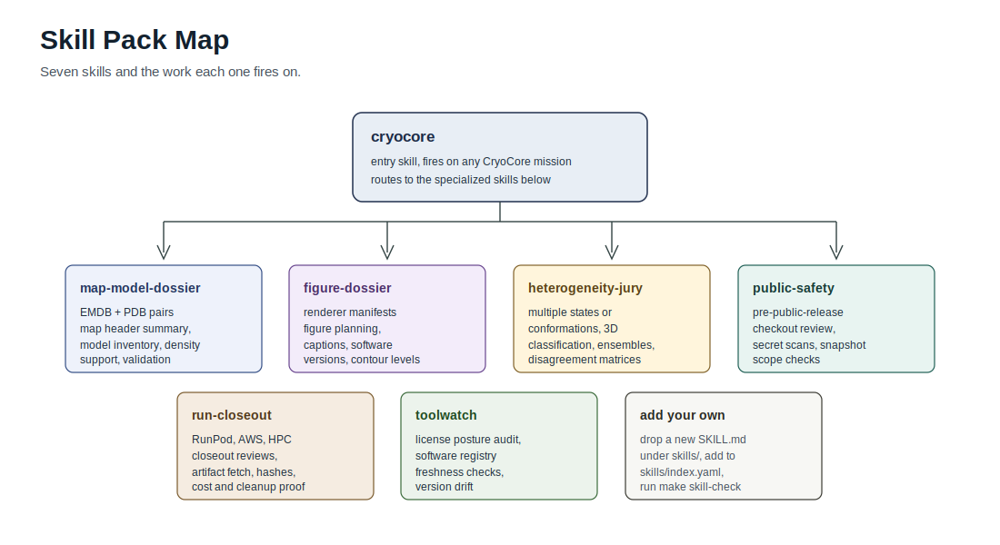

# CryoCore Skills



These repo-local skills help agents use CryoCore safely.

Point your agent at the repository root and start with:

```text
Use the CryoCore skill pack. Stay local. Read AGENTS.md, README.md,
docs/agent-quickstart.md, and the relevant skill under skills/. Produce a
public-safe, claim-bounded result and run the relevant validators.
```

| Skill | Use When |
| --- | --- |
| `cryocore` | General CryoCore planning, manifests, local validation, and mode routing. |
| `cryocore-public-safety` | Public release, privacy, secret, provider-cost, and claim-safety review. |
| `cryocore-map-model-dossier` | Public EMDB/PDB map-model dossiers and evidence bundles. |
| `cryocore-run-closeout` | Provider closeout, artifact hashes, cost, cleanup, and no-false-success checks. |
| `cryocore-toolwatch` | Tool, preprint, API, workflow, and license posture updates. |
| `cryocore-heterogeneity-jury` | Heterogeneity, ensembles, state analysis, and disagreement review. |
| `cryocore-figure-dossier` | Structural figures, renderer posture, captions, and reproducibility. |

Start with `skills/cryocore/SKILL.md`, then route to the specialized skill.
Use `skills/cryocore-public-safety/SKILL.md` before publishing or accepting
outside contributions.

See `docs/use-cases.md` for prompts that map user goals to skills.

Run:

```bash
make release-check
```

before making public-readiness claims.
